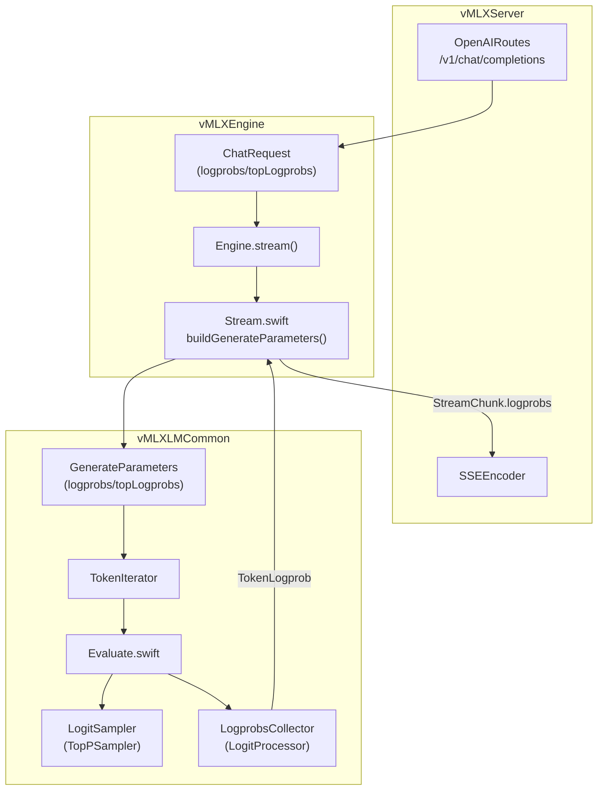
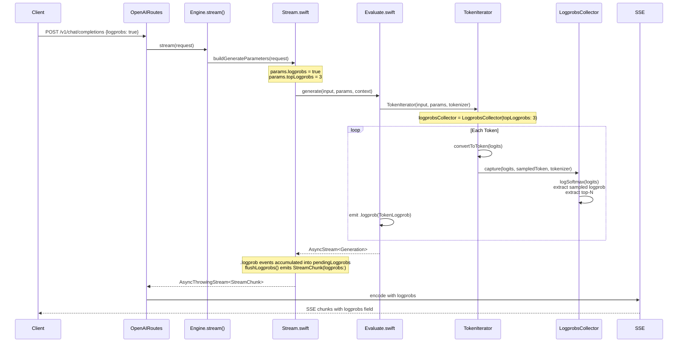

# LogProbs Endpoint Implementation

**Iteration:** 96 | **Date:** 2026-04-20 | **Status:** Complete

## Overview

Implemented the OpenAI-compatible `logprobs` parameter for `/v1/chat/completions`, enabling callers to request per-token log probabilities in both streaming (SSE) and non-streaming chat completion responses.

## API Contract

### Request

```json
{
  "model": "qwen3-0.6b",
  "messages": [{"role": "user", "content": "hello"}],
  "logprobs": true,
  "top_logprobs": 3
}
```

- `logprobs` (bool): Whether to return log probabilities of the output tokens.
- `top_logprobs` (int, 0–20): Number of most likely tokens to return at each position.

### Response (non-streaming)

```json
{
  "choices": [{
    "index": 0,
    "message": {"role": "assistant", "content": "Hello!"},
    "logprobs": {
      "content": [
        {"token": "Hello", "logprob": -0.6377, "top_logprobs": [
          {"token": "Hello", "logprob": -0.6377},
          {"token": "Hi", "logprob": -1.4346},
          {"token": "Hey", "logprob": -2.1221}
        ]},
        {"token": "!", "logprob": -0.0031, "top_logprobs": [...]}
      ]
    },
    "finish_reason": "stop"
  }]
}
```

### Response (streaming SSE chunk)

```json
{
  "id": "chatcmpl-abc123",
  "object": "chat.completion.chunk",
  "choices": [{
    "index": 0,
    "delta": {"content": " the"},
    "logprobs": {
      "content": [{
        "token": " the",
        "logprob": -0.1234,
        "top_logprobs": [
          {"token": " the", "logprob": -0.1234},
          {"token": " a", "logprob": -0.2010}
        ]
      }]
    },
    "finish_reason": null
  }]
}
```

## Architecture



## Data Flow



## Changes by File

### 1. `Sources/vMLXLMCommon/Evaluate.swift` (+239 lines)

**New types:**

| Type | Role |
|------|------|
| `TokenLogprob` | Per-token logprob data: `token` (string), `logprob` (Float), `byteOffset` (Int?), `topLogprobs` ([TopTokenLogprob]) |
| `TopTokenLogprob` | Single alternative: `token` (string), `logprob` (Float) |
| `LogprobsCollector` | `LogitProcessor` that captures per-token logprobs via `logSoftmax` after penalty processing |

**GenerateParameters** — Added fields:
```swift
public var logprobs: Bool = false
public var topLogprobs: Int = 0

public func logprobsProcessor() -> LogprobsCollector? {
    guard logprobs else { return nil }
    return LogprobsCollector(topLogprobs: topLogprobs)
}
```

**TokenIterator** — Added `logprobsCollector` and `logprobsTokenizer` fields, plus `tokenizer:` init parameter. In `convertToToken()`: after penalty processing and sampling, calls `logprobsCollector.capture(logits:sampledToken:tokenizer:)`.

**TokenIteratorProtocol** — Added:
```swift
var collectedLogprobs: [TokenLogprob] { get }
mutating func popCollectedLogprobs() -> [TokenLogprob]
```

**Generation enum** — Added `.logprob(TokenLogprob)` case with accessor.

**generateLoopTask** — Changed from `for token in iterator` to `while let token = iter.next()` loop. After each token, pops collected logprobs and emits `.logprob()` events guarded by `Handler.Output.self == Generation.self` (since `TokenGeneration` lacks the `.logprob` case).

### 2. `Sources/vMLXEngine/ChatRequest.swift` (+27 lines)

- Added `import vMLXLMCommon`
- Removed `logprobs == true` rejection in `validate()` — logprobs is now supported
- Added `logprobs: [TokenLogprob]?` field to `StreamChunk`
- Added `logprobs` parameter to `StreamChunk.init()`

### 3. `Sources/vMLXEngine/Stream.swift` (+29 lines)

- Added `pendingLogprobs: [TokenLogprob]` accumulator
- Added `shouldCollectLogprobs` flag from `request.logprobs`
- Added `flushLogprobs()` helper that yields `StreamChunk(logprobs:)` before content
- Added `.logprob` case in the stream event switch to accumulate into `pendingLogprobs`
- Flush calls before content yields and at `.info` case
- Wired `request.logprobs` and `request.topLogprobs` into `GenerateParameters`

### 4. `Sources/vMLXServer/SSEEncoder.swift` (+29 lines)

- Added `import vMLXLMCommon`
- Logprobs encoding block after finishReason/usage tracking: maps `TokenLogprob` to OpenAI JSON format inside `delta.logprobs.content`
- Handles `top_logprobs` sub-array, `bytes_offset` when present

### 5. `Sources/vMLXServer/Routes/OpenAIRoutes.swift` (+32 lines)

- Added `import vMLXLMCommon`
- `allLogprobs` accumulator in the non-streaming collection loop
- Collects `chunk.logprobs` from each stream chunk
- Encodes full logprobs array into `choices[0].logprobs.content` in the final JSON

### 6. `Package.swift` (+1 line)

- Added `"vMLXLMCommon"` to `vMLXServer` target dependencies (needed for `TokenLogprob` visibility)

### 7. `tests/e2e/harness.sh` (+144/-48 lines)

- `case_unsupported_params`: Moved `logprobs_true` from "reject" to "accept" group; updated doc comment
- `case_logprobs`: Rewritten — strict validation of HTTP 200, `choices[0].logprobs.content` non-empty, per-entry token/logprob/top_logprobs checks, descending sort verification
- `case_logprobs_streaming`: New test — SSE stream with `logprobs:true`, verifies logprob entries appear alongside content deltas
- Path fixes: replaced hardcoded `/Users/eric/...` with `$REPO_ROOT`-based relative paths; added `REPO_ROOT` variable

## E2E Test Results

**Model:** Gemma-4-26B-A4B-it-JANG_4M | **Date:** 2026-04-20

| Test | Result | Details |
|------|--------|---------|
| `case_logprobs` (non-streaming) | PASS | 6 tokens returned, first logprob=-0.6377, 3 top alternatives per token, all descending sorted |
| `case_logprobs_streaming` | PASS | 6 logprob entries, 5 content chunks in SSE stream |

Sample output (non-streaming):
```
entry[0]: token='<|channel>'  logprob=-0.6377
  alt[0]: logprob=-0.6377  token='<|channel>'
  alt[1]: logprob=-1.4346  token='<channel|>'
  alt[2]: logprob=-2.1221  token='thought'
entry[4]: token='Hello'  logprob=-0.0000
  alt[0]: logprob=-0.0000  token='Hello'
  alt[1]: logprob=-13.1484  token='Hi'
  alt[2]: logprob=-14.7139  token=' Hello'
```

## Gotchas and Bugs Found

### 1. Missing closing brace in while-loop (Evaluate.swift)

**Problem:** The `generateLoopTask` was changed from `for token in iterator` to `while let token = iter.next()`. The `for` loop's closing `}` was removed as part of the edit, but no new `}` was added for the `while` loop. This caused cascading "cannot find type" errors for every type defined after the function (`GenerateCompletionInfo`, `Generation`, `GenerateStopReason`).

**Fix:** Added `}` before `if stopReason == nil` to close the while loop.

**Lesson:** When converting loop constructs, always verify brace balance independently — the compiler error messages point at the wrong location (the types below, not the missing brace).

### 2. Generic type safety for `.logprob` in `generateLoopTask<Handler>`

**Problem:** `generateLoopTask` is generic over `Handler: TokenLoopHandler` where `Handler.Output` can be `Generation` or `TokenGeneration`. The `.logprob(lp)` case only exists on `Generation`, not `TokenGeneration`. Emitting `continuation.yield(.logprob(lp))` inside the generic context fails with "type 'Handler.Output' has no member 'logprob'".

**Fix:** Guard with `if Handler.Output.self == Generation.self` and cast: `continuation.yield(Generation.logprob(lp) as! Handler.Output)`.

**Lesson:** Generic token loop handlers need type-level dispatch for output-type-specific events. The `as!` is safe because the guard guarantees the type.

### 3. `top_logprobs` sort order was ascending instead of descending

**Problem:** `argSort(flatLogProbs, axis: -1)` returns indices in ascending order (smallest values first). For log probabilities (which are negative), ascending gives the *least likely* tokens first. OpenAI requires descending order (highest logprob / most likely first). The initial implementation took `sortedIndices[0..<n]` which gave the N least likely tokens, then `sortedIndices[(total-n)..<total]` which gave the right tokens but still in ascending order.

**Fix:** `sortedIndices[(total - n)..<total].asArray(Int.self).reversed()` — slice the last N (highest) indices, then reverse to get descending order.

**Lesson:** MLX's `argSort` follows NumPy convention (ascending). Always verify sort direction when extracting top-K from sorted indices.

### 4. Missing `import vMLXLMCommon` in dependent targets

**Problem:** `TokenLogprob` is defined in `vMLXLMCommon` but used in `ChatRequest.swift` (vMLXEngine), `SSEEncoder.swift` (vMLXServer), and `OpenAIRoutes.swift` (vMLXServer). These files had compile errors "cannot find type 'TokenLogprob' in scope".

**Fix:** Added `import vMLXLMCommon` to all three files, and added `"vMLXLMCommon"` as a dependency of the `vMLXServer` target in `Package.swift`.

**Lesson:** When adding shared types to a library module, trace all consumers and ensure both the import and the Package.swift dependency are added.

### 5. Catastrophic sed on Package.swift

**Problem:** Using `sed` to delete `"vMLXLMCommon",` removed ALL occurrences of that string across the entire Package.swift file, not just the one in the `vMLXServer` target's dependencies. This wiped out the `vMLXLMCommon` dependency from other targets that legitimately needed it.

**Fix:** `git checkout -- Package.swift` and re-applied the targeted edit.

**Lesson:** Never use global `sed` delete on strings that may appear multiple times. Always use line-numbered or context-anchored replacements.

### 6. SSE string interpolation bug in SSEEncoder.swift

**Problem:** A sed replacement produced `"data: (j)\n\n"` instead of `"data: \(j)\n\n"`. Swift string interpolation requires the backslash; without it, `(j)` is a literal parenthesized expression.

**Fix:** Targeted sed to restore the backslash.

**Lesson:** When using sed on Swift source, escape backslashes carefully: `\\(` in sed produces `\(` in the output.

## Design Decisions

| Decision | Choice | Rationale |
|----------|--------|-----------|
| Logprobs computed when? | After penalty processing (post-repetition/presence/frequency) | Reflects the actual sampling distribution the model used; matches what the sampler "saw" |
| `top_logprobs` includes chosen token? | Yes | The chosen token naturally appears as the highest logprob entry in `top_logprobs`; matches OpenAI behavior |
| Streaming delivery | Per-token in SSE chunks via `StreamChunk.logprobs` | Matches OpenAI behavior; client sees logprobs incrementally alongside content |
| Non-streaming delivery | Accumulated array in final response | All token logprobs in `choices[0].logprobs.content` |
| Speculative decoding | Returns empty logprobs | `SpeculativeTokenIterator` has no logprobs collector; speculative decoding changes token selection semantics making logprobs misleading |
| `TokenGeneration` mode | No logprobs emitted | The `.logprob` case only exists on `Generation`, not `TokenGeneration`; raw token mode has no text context for logprobs |
| `bytes` field (OpenAI `bytes` array) | **Implemented (§163.B1)** — `bytes: [Int]` UTF-8 byte array of the token string (spec-compliant, not `bytes_offset`). lm-evaluation-harness and official OpenAI SDKs key on this exact field name. |
| `prompt_logprobs` | Not implemented | Requires capturing logits during prefill; separate code path from decode; deferred to follow-up |
| Stop-sequence rollback semantics (§163.B3) | **Logprobs count == sampled-token count**, not per emitted character. When a stop sequence trims the final content delta, the logprob for that sampled step still appears in `logprobs.content`. This matches OpenAI's actual behavior — logprob entries reflect sampling decisions, not what survived post-processing. |
| Reasoning / tool-call tokens (§163.B6) | **Filtered from `logprobs.content`**. Tokens whose text was entirely consumed by the reasoning parser (`<think>…</think>`) or by a tool-call marker buffer are dropped from the content logprobs array. OpenAI's contract is that `choices[0].logprobs.content[i]` maps 1:1 with tokens of `message.content`; reasoning lives on `message.reasoning_content` and tool-call bytes live on `message.tool_calls` — neither participate in `logprobs.content`. |
| Single SSE frame per token (§163.B4) | **Implemented** — `delta.logprobs.content` is bundled into the SAME SSE frame as the matching `delta.content` slice. Strict consumers (lm-evaluation-harness, LangChain logprob-aware chains) that map `delta.logprobs.content[i]` to the character just produced now see them on the same wire tick. |
| Top-K selection (§163.B2) | **Partial scan** — single GPU→CPU copy of the logprob row followed by an in-place top-N scan (O(V·N) for N≤20 vs. former O(V log V) full sort). Saves several ms/token on 150k-vocab Qwen3.5-35B with `top_logprobs: 20`. |

## Future Work

### 1. `prompt_logprobs` Support

OpenAI supports returning log probabilities for the input prompt tokens. This requires capturing logits during the prefill phase, which is a separate code path from the decode loop. The `LogprobsCollector.capture()` method could be extended, but the prefill path in `Evaluate.swift` does not currently expose per-token logits.

**Estimated complexity:** Medium — needs prefill logit interception and a separate accumulator.

### 2. `bytes` Field per Token — **DONE (§163.B1)**

Each token carries `bytes: [Int]` (UTF-8 byte array of the token string). Populated at capture time in `LogprobsCollector.capture()`; emitted by both the chat-completions and legacy-completions routes and the SSE encoder. Spec-compliant with OpenAI's `chat.completion.choices[0].logprobs.content[i].bytes`.

### 3. `text_completion` Logprobs (Legacy `/v1/completions`) — **DONE (§163.B5)**

Non-streaming `/v1/completions` response now emits `choices[0].logprobs = {tokens, token_logprobs, top_logprobs, text_offset}` in the legacy flat-array shape (distinct from chat's `{content: [...]}`). This is the exact shape lm-evaluation-harness reads. SSE streaming for the legacy endpoint is a follow-up.

### 4. Logprobs Unit Tests

No unit tests exist for `LogprobsCollector` itself. A unit test should verify:
- Known logits vector produces correct log-softmax values
- Top-K extraction returns correct count and ordering
- Edge case: `top_logprobs=0` produces empty `top_logprobs` array
- Edge case: `logprobs=false` produces no collector

**Estimated complexity:** Low — pure logic testing with MLX array inputs.

### 5. Performance Benchmarking

`logSoftmax` is computed over the full vocabulary (typically 128k–256k tokens) for every generated token when `logprobs=true`. The `argSort` over the full vocabulary adds further cost. This should be benchmarked to quantify the tokens-per-second impact when logprobs are enabled.

**Potential optimization:** Instead of full `argSort`, use a top-K selection algorithm (partial sort) which is O(n + k log k) instead of O(n log n).

**Estimated complexity:** Medium — needs MLX top-K primitive or custom implementation.

### 6. Speculative Decoding Logprobs

Currently `SpeculativeTokenIterator` returns empty logprobs. When speculative decoding is active, logprobs could be collected for the accepted tokens only (rejected draft tokens are discarded). This requires wiring `LogprobsCollector` into the speculative path.

**Estimated complexity:** High — speculative decoding has complex token acceptance/rejection semantics.
